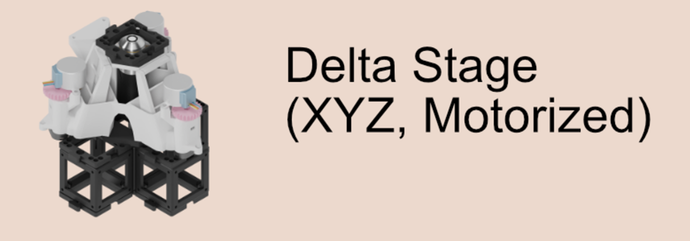
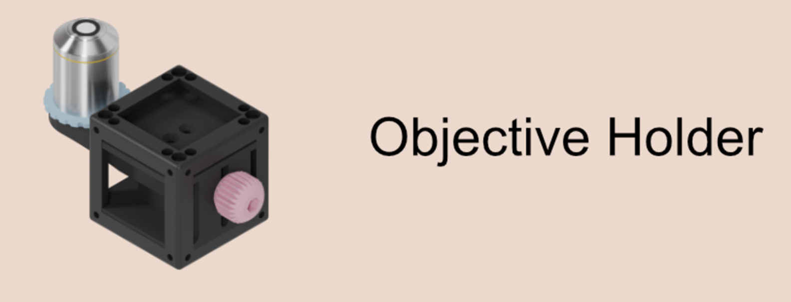
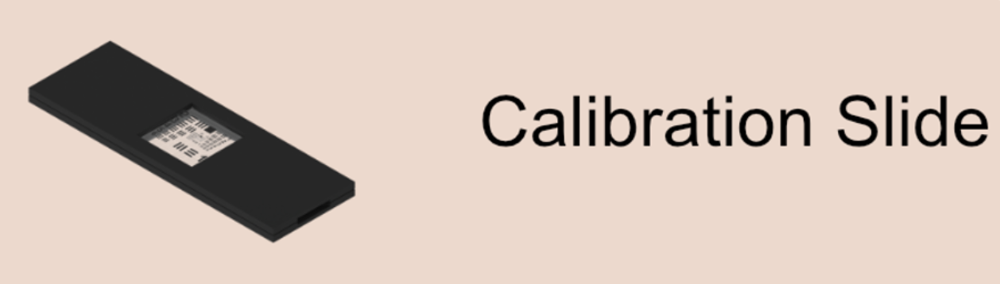

# 3D Printing STL Files

This repository contains STL files designed for various components used in open microscopy setups. Below is a description of each file and its intended use. All parts were printed on standard FDM printers such as Ultimaker 3 or Bambulab X1C

## Files

### 1. Connector Piece between UC2 Cubes and OpenFlexure DeltaStage

This STL file contains the design for a connector piece that bridges UC2 cubes with the OpenFlexure DeltaStage. It ensures a secure and stable connection between these components, facilitating precise alignment and integration.

### 2. New Objective Holder

This STL file features a new objective holder designed to accommodate various microscope objectives. The holder provides a stable and adjustable mount, allowing for easy swapping and positioning of objectives during microscopy experiments.

### 3. Calibration Slide Holder

This STL file includes the design for a calibration slide holder. The holder is used to securely position calibration slides, ensuring accurate and repeatable measurements during microscopy calibration procedures.

### 4. Cardboard Enclosure with Connector Pieces and Cube Inserts

This STL file contains the design for a cardboard enclosure that incorporates connector pieces and cube inserts. The enclosure is designed to be light-tight, ensuring that the microscopy setup is protected from external light sources. The connector pieces are printed and the cube inserts are positioned on the sides to maintain light closure.

